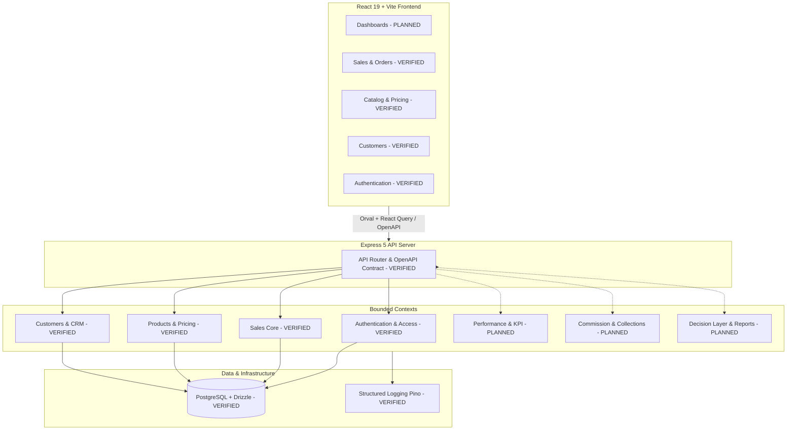
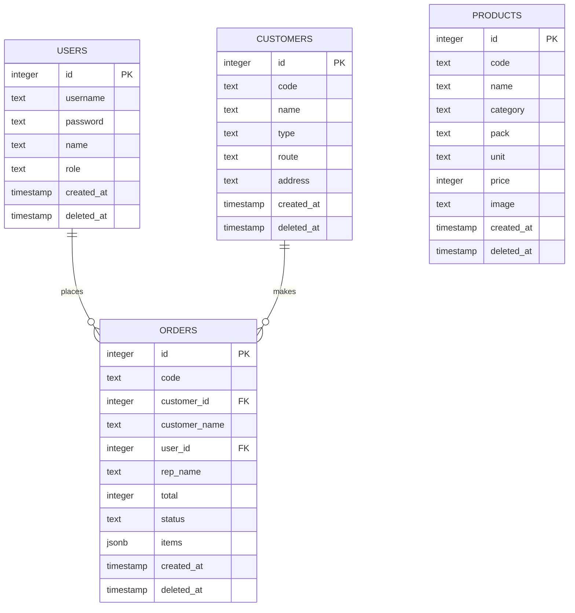
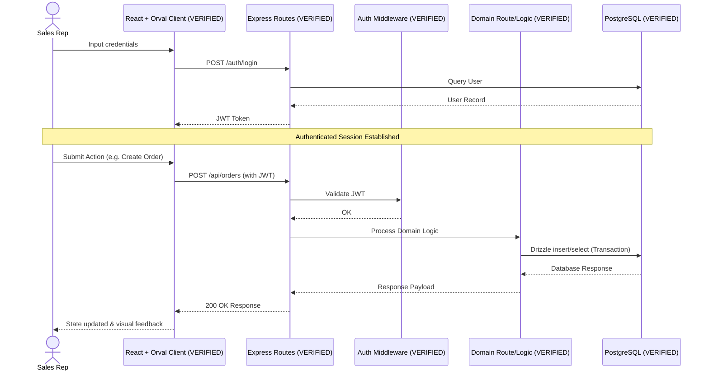

# Architecture Graphs

## Evidence and Verification Status

The diagrams below are derived from code inspection of the actual repository state.

*   **VERIFIED**: Supported by current source code, Drizzle schemas, OpenAPI contracts, and Express API routes.
*   **PLANNED / MVP DOMAIN**: Defined in `docs/00_Project/Roadmap.md` and `PROJECT_STATE.md` but not yet fully implemented in code.
*   **TBD**: Not verifiable from the current repository.

---

## A. High-level System / Context Diagram

## B. Database ER Diagram

> Derived directly from `lib/db/src/schema` (Drizzle definitions).

*(Note: `ORDER_ITEMS` is modeled as a `jsonb` array inside `ORDERS` in this specific implementation, as verified in `orders.ts`)*

## C. Request / Data Flow Sequence

> Generic verified request flow observed in the current codebase for authenticated data retrieval and insertion.

